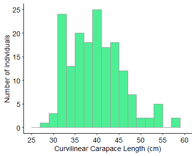
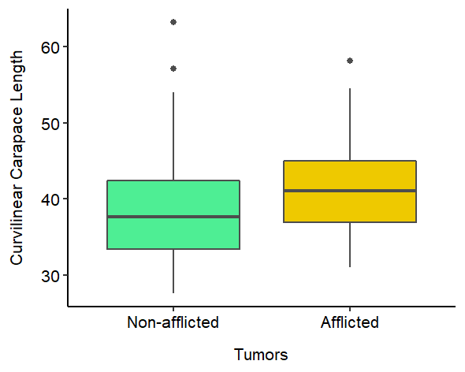

## Tumor Occurrence in Juvenile Green Turtles (_Chelonia mydas_) </br> in Southern Brazil

#### Introduction

The green turtle, _Chelonia mydas_, is one of the seven recognized species of sea turtles and is globally classified as endangered @Seminoff2004. During their life cycle, green turtles are exposed to multiple threats such as pollution, fisheries bycatch, habitat destruction, and the occurrence of diseases @Rees2016. Fibropapilomatosis is a virus-born neoplastic disease most common in green turtles, especially juveniles @Jones2016. Tumor formation by fibropapilomatosis can compromise turtles' locomotion, food ingestion, vision, and reproduction. Investigating this disease is considered a research priority by specialists working in sea turtle biology and conservation @Rossi2016.   


This project aims to: (i) explore the occurrence of fibropapilomatosis tumors (hereafter tumors) and (ii) test if there is difference in the size between juvenile green turtles afflicted and non-afflicted by tumors, in a foraging ground in Parana State, Southern Brazil.

#### Methods

To achieve this project goals, a dataset from a capture-mark-recapture study led by the Laboratório de Ecologia e Consevação - UFPR was used. The sea turtles were intentionally captured using well-established techniques @Nunes2021 on the Parana State coast, Southern Brazil (25°29'09"S 48°24'28"W). After being captured, the green turtles were evaluated by a veterinarian for tumor affliction. Also, the curvilinear carapace length (CCL) was measured (cm) with a flexible tape. 

For the turtles afflicted by tumors, the tumor index was calculated which takes into account the number and size of the tumors and indicates the disease severity @Rossi2016. The occurrence of tumors was explored by the percentage of individuals afflicted by the disease. Descriptive statistics for  CCL and tumor index. Variability in CCL regarding tumor affliction was assessed using a generalized linear model.

#### Results

Overall, 170 green turtles were evaluated and the CCL ranged from 27.6 to 63.2 cm (mean = 39.9 cm; standard deviation = 6.3 cm) (Figure 1). Approximately, 51% of the turtles were afflicted by tumors (n = 86) for which the tumor index ranged from 0.1 to 232 (median = 8.0; mean = 43.9; sd = 69.9; n = 55). Therefore, the population was mostly mildly afflicted by tumors (74%; n = 41), followed by severely (15%; n = 8) and moderately (10%; n = 6).

```{r CCL-histo, echo=FALSE, fig.cap="Figure 1 Distribution of Curvilinear Carapace Length (cm) of green turtles intentionally captured on the Parana State coast, Southern Brazil", fig.align = 'center'}

```
Regarding the relationship between green turtle size and the tumor affliction, the null model poorly explained the variation on the CCL compared to the model with the tumor affliction. The better fitted model showed a significant difference between the mean CCL in green turtles afflicted by tumors and those non-afflicted. In general, green turtles afflicted by tumors (mean CCL = 41.2 cm; sd = 5.9 cm) are larger than the non-afflicted ones (mean CCL = 38.6 cm; sd = 6.4) (Figure 2).

```{r tumor-boxp, echo=FALSE, fig.cap="Figure 2 Difference in curvilinear carapace length in green turtles afflicted and non-afflicted by tumors.", fig.align = 'center'}

```

#### Discussion

The green turtles evaluated are considered all juveniles (CCL < 80 cm) aging between 2 and 16 years @Lenz2017. The prevalence of 51% of tumors is higher considering other foraging ground populations in the Atlantic Ocean @Foley2005 @Lopez-Mendilaharsu2016. Similar to previous studies, green turtles between CCL 35 and 45 cm are more frequently afflicted by tumors @Foley2005 @Lopez-Mendilaharsu2016 @Santos2010. The difference in tumor prevalence between CCL classes could have two possible explanations @Santos2010: (1) Exposure to one or more pathogens occurs in the coastal zone, with a long incubation period for the disease, and first clinical signs appear only in older juveniles; (2) Pathogen exposure occurs after juveniles are recruited to coastal zones. However, regardless of the time of infection tumor formation might be linked to low environmental quality, which reduces immunity to stress @Santos2010. Further investigations from different regions are critical to improving our understanding of the disease, which in turn will inform the management and conservation of endangered species.

#### References  

<div id="refs"></div>