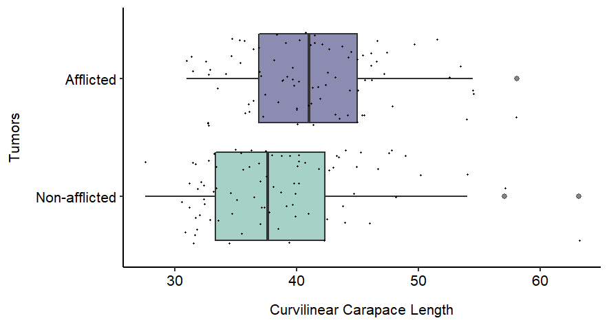

## Tumor Occurrence in Juvenile Green Turtles (_Chelonia mydas_) </br> in Southern Brazil

#### Introduction

The green turtle, _Chelonia mydas_, is one of the seven recognized species of sea turtles and is globally classified as endangered. During their life cycle, green turtles are exposed to multiple threats such as pollution, fisheries bycatch, habitat destruction, and the occurrence of diseases. Fibropapilomatosis is a virus-born neoplastic disease most common in green turtles, especially juveniles. Tumor formation by fibropapilomatosis can compromise turtles' locomotion, food ingestion, vision, and reproduction. Investigating this disease is considered a research priority by specialists working in sea turtle biology and conservation.   


This project aims to: (i) explore the occurrence of fibropapilomatosis tumors (hereafter tumors) and (ii) test if there is difference in the developmental stage between juvenile green turtles afflicted and non-afflicted by tumors, in a foraging ground in Parana State, Southern Brazil.

#### Methods

To achieve the goals of this project I used a dataset from a capture-mark-recapture study lead by the Laboratório de Ecologia e Consevação - UFPR. The sea turtles were intentionally captured using well established techniques (see method in REF) on Parana State coast, Southern Brazil (25°29'09"S 48°24'28"W). After being captured, the green turtles were evaluated by a veterinarian for tumor affliction. Also, to infer the developmental stage of the turtles the curvilinear carapace length (CCL) was measured (cm) with flexible tape. 

For the turtles afflicted by tumor the tumor index was calculated which takes into account the number and size of the tumors and indicates de severity of the disease (REF). To explore the occurrence of tumors in green turtles I calculated prevalence of tumors in the local population and the descriptive statics of the CCL and the tumor index. To test the relationship between developmental stage and the tumor affliction I applied a generalized linear model.

#### Results

Overall, 170 green turtles were evaluated and the CCL ranged from 27.6 to 63.2 cm (mean = 39.9 cm; standard deviation = 6.3 cm). Approximately, 51% of the turtles were afflicted by tumors (n = 86) for which the tumor index ranged from 0.1 to 232 (median = 8.0; mean = 43.9; sd = 69.9; n = 55). Therefore, the population was mostly mildly afflicted by tumors (74%; n = 41), followed by severely (15%; n = 8) and moderately (10%; n = 6).

```{r, fig.cap = "XXX"}
knitr::include_graphics("../figures/01_CCL_histogram.png")
```
Regarding the relationship between developmental stage and the tumor affliction, the null model poorly explained the variation on the CCL compared to the model with the tumor affliction. The better fitted model showed a significant difference between the mean CCL in green turtles afflicted by tumors and those non-afflicted. In general, green turtles afflicted by tumors (mean CCL = 41.2 cm; sd = 5.9 cm) are larger than the non-afflicted ones (mean CCL = 38.6 cm; sd = 6.4).

```{r, fig.cap = "XXX"}

```

##