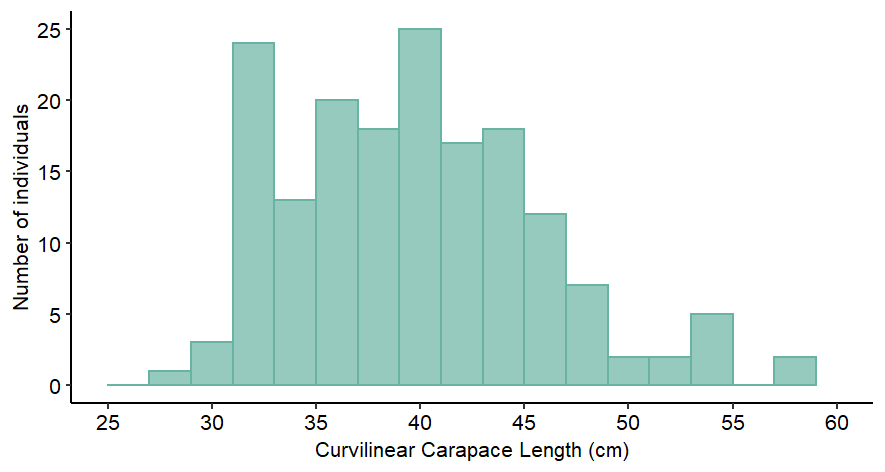

Results Report
================
Tawane Nunes
2022-08-18

## Tumor Occurrence in Juvenile Green Turtles (*Chelonia mydas*)   in Southern Brazil

#### Introduction

The green turtle, *Chelonia mydas*, is one of the seven recognized
species of sea turtles and is globally classified as endangered \[1\].
During their life cycle, green turtles are exposed to multiple threats
such as pollution, fisheries bycatch, habitat destruction, and the
occurrence of diseases \[2\]. Fibropapilomatosis is a virus-born
neoplastic disease most common in green turtles, especially juveniles
\[3\]. Tumor formation by fibropapilomatosis can compromise turtles’
locomotion, food ingestion, vision, and reproduction. Investigating this
disease is considered a research priority by specialists working in sea
turtle biology and conservation \[4\].

This project aims to: (i) explore the occurrence of fibropapilomatosis
tumors (hereafter tumors) and (ii) test if there is difference in the
size between juvenile green turtles afflicted and non-afflicted by
tumors, in a foraging ground in Parana State, Southern Brazil.

#### Methods

To achieve this project goals, a dataset from a green turtle
capture-mark-recapture study from 2014 to 2019 led by the Laboratório de
Ecologia e Consevação - UFPR was used. All activities were under the
Brazilian Scientific Permit from the Ministry of the Environment SISBIO
74581-6.The sea turtles were intentionally captured using
well-established techniques \[5\] on the Parana State coast, Southern
Brazil (25°29’09”S 48°24’28”W). After being captured, the green turtles
were evaluated by a veterinarian for tumor affliction. Also, the
curvilinear carapace length (CCL) was measured (cm) with a flexible
tape.

For the turtles afflicted by tumors, the tumor index was calculated
which takes into account the number and size of the tumors and indicates
the disease severity \[4\]. The occurrence of tumors was explored by the
percentage of individuals afflicted by the disease. Descriptive
statistics for CCL and tumor index. Variability in CCL regarding tumor
affliction was assessed using a generalized linear model.

#### Results

Overall, 170 green turtles were evaluated and the CCL ranged from 27.6
to 63.2 cm (mean = 39.9 cm; standard deviation = 6.3 cm) (Figure 1).
Approximately, 51% of the turtles were afflicted by tumors (n = 86) for
which the tumor index ranged from 0.1 to 232 (median = 8.0; mean = 43.9;
sd = 69.9; n = 55). Therefore, the population was mostly mildly
afflicted by tumors (74%; n = 41), followed by severely (15%; n = 8) and
moderately (10%; n = 6).

Regarding the relationship between green turtle size and the tumor
affliction, the null model poorly explained the variation on the CCL
compared to the model with the tumor affliction. The better fitted model
showed a significant difference between the mean CCL in green turtles
afflicted by tumors and those non-afflicted. In general, green turtles
afflicted by tumors (mean CCL = 41.2 cm; sd = 5.9 cm) are larger than
the non-afflicted ones (mean CCL = 38.6 cm; sd = 6.4) (Figure 2).

#### Discussion

The green turtles evaluated are considered all juveniles (CCL \< 80 cm)
aging between 2 and 16 years \[6\]. The prevalence of 51% of tumors is
higher considering other foraging ground populations in the Atlantic
Ocean \[7\] \[8\]. Similar to previous studies, green turtles between
CCL 35 and 45 cm are more frequently afflicted by tumors \[7\] \[8\]
\[9\]. The difference in tumor prevalence between CCL classes could have
two possible explanations \[9\]: (1) Exposure to one or more pathogens
occurs in the coastal zone, with a long incubation period for the
disease, and first clinical signs appear only in older juveniles; (2)
Pathogen exposure occurs after juveniles are recruited to coastal zones.
However, regardless of the time of infection tumor formation might be
linked to low environmental quality, which reduces immunity to stress
\[9\]. Further investigations from different regions are critical to
improving our understanding of the disease, which in turn will inform
the management and conservation of endangered species.

#### References

\[1\] J. A. A. (Southwest. F. S. C. U. S. ). Seminoff
and (Southwest. F. S. C. U. S.), “Chelonia
mydas,” vol. 8235. The IUCN Red List of Threatened Species, 2004.
doi:
<http://dx.doi.org/10.2305/IUCN.UK.2004.RLTS.T4615A11037468.en>.

\[2\] A. F. Rees *et al.*, “Are
we working towards global research priorities for management and
conservation of sea turtles?” vol. 31. pp. 337–382, Dec. 2016.
doi: [10.3354/esr00801](https://doi.org/10.3354/esr00801).

\[3\] K. Jones, E. Ariel, G. Burgess, and M. Read,
“A review of fibropapillomatosis in Green turtles
(Chelonia mydas),” *The Veterinary Journal*, vol. 212, pp. 48–57,
Jun. 2016, doi:
[10.1016/j.tvjl.2015.10.041](https://doi.org/10.1016/j.tvjl.2015.10.041).

\[4\] S. Rossi *et al.*, “Challenges in Evaluating the Severity of
Fibropapillomatosis: A Proposal for Objective Index and Score System for
Green Sea Turtles (Chelonia mydas) in Brazil,” *PLOS ONE*, vol.
11, no. 12, p. e0167632, Dec. 2016, doi:
[10.1371/journal.pone.0167632](https://doi.org/10.1371/journal.pone.0167632).

\[5\] T. Y. Nunes, “Ecologia
Populacional e Espacial de Tartarugas-verde Juvenis, Chelonia mydas, no
Litoral do Paraná, Sul do Brasil,”
Master's degree dissertation, Universidade Federal do Paraná,
2021.

\[6\] A. Lenz, L. Avens, and M. Borges-Martins,
“Age and growth of juvenile green turtles Chelonia
mydas in the western South Atlantic Ocean,” *Marine Ecology
Progress Series*, vol. 568, pp. 191–201, Mar. 2017, doi:
[10.3354/meps12056](https://doi.org/10.3354/meps12056).

\[7\] A. M. Foley, B. A. Schroeder, A. E. Redlow, K.
J. Fick-Child, and W. G. Teas, “Fibropapillomatosis
in stranded green turtles (Chelonia mydas) from the eastern United
States (1980-98): Trends and associations with environmental
factors,” *Journal of Wildlife Diseases*, vol. 41, no. 1, pp.
29–41, 2005, doi:
[10.7589/0090-3558-41.1.29](https://doi.org/10.7589/0090-3558-41.1.29).

\[8\] M. López-Mendilaharsu *et al.*, “Demographic and tumour prevalence data for juvenile green
turtles at the Coastal-Marine Protected Area of Cerro Verde,
Uruguay,” *Marine Biology Research*, vol. 12, no. 5, pp. 541–550,
2016, doi:
[10.1080/17451000.2016.1169294](https://doi.org/10.1080/17451000.2016.1169294).

\[9\] R. dos Santos *et al.*, “Relationship between fibropapillomatosis and
environmental quality: a case study with Chelonia mydas off
Brazil,” *Diseases of Aquatic Organisms*, vol. 89, no. 1, pp.
87–95, Feb. 2010, doi:
[10.3354/dao02178](https://doi.org/10.3354/dao02178).

